**Enterprise Multi-VLAN Network with OSPF & Centralized DHCP**

Cisco Packet Tracer Project

**Project Overview**

This project demonstrates the implementation of an enterprise-grade network infrastructure using Cisco Packet Tracer. The network is designed with:

VLAN segmentation

Inter-VLAN routing

OSPF dynamic routing

Centralized DHCP services

DHCP relay (ip helper-address)

Wireless connectivity

Multi-router WAN communication

The topology simulates a real-world enterprise environment where different departments are separated into VLANs while maintaining communication through Layer 3 routing.

**Network Topology**

The topology includes:

4 Cisco 2911 Routers

Multiple Cisco 2960 Switches

Centralized DHCP Server

Wireless Access Point

PCs, Printer, Laptop, Tablet, Smartphone

Department-based VLAN segmentation

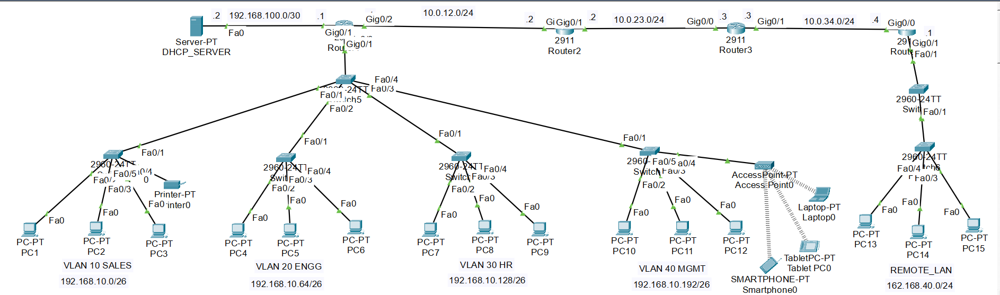

**VLAN and Department Structure**

**VLAN	Department - Network Address	- Default Gateway**

VLAN 10	Sales -	192.168.10.0/26 -	192.168.10.1

VLAN 20	Engineering	- 192.168.10.64/26	- 192.168.10.65

VLAN 30	HR	- 192.168.10.128/26	- 192.168.10.129

VLAN 40	Management	- 192.168.10.192/26	- 192.168.10.193

Remote LAN	-	192.168.40.0/24	- 192.168.40.1

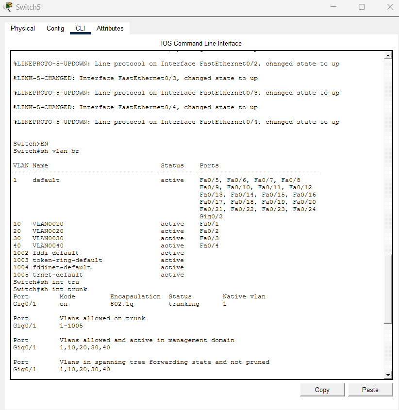

**Technologies Used**

Cisco Packet Tracer

Cisco IOS

OSPF Routing Protocol

DHCP

VLANs

802.1Q Trunking

Router-on-a-Stick

Wireless Networking

**Network Features**

**1. Inter-VLAN Routing**

Router1 performs inter-VLAN routing using the Router-on-a-Stick method with subinterfaces configured for each VLAN.

Example:

interface GigabitEthernet0/0.10

 encapsulation dot1Q 10
 
 ip address 192.168.10.1 255.255.255.192

 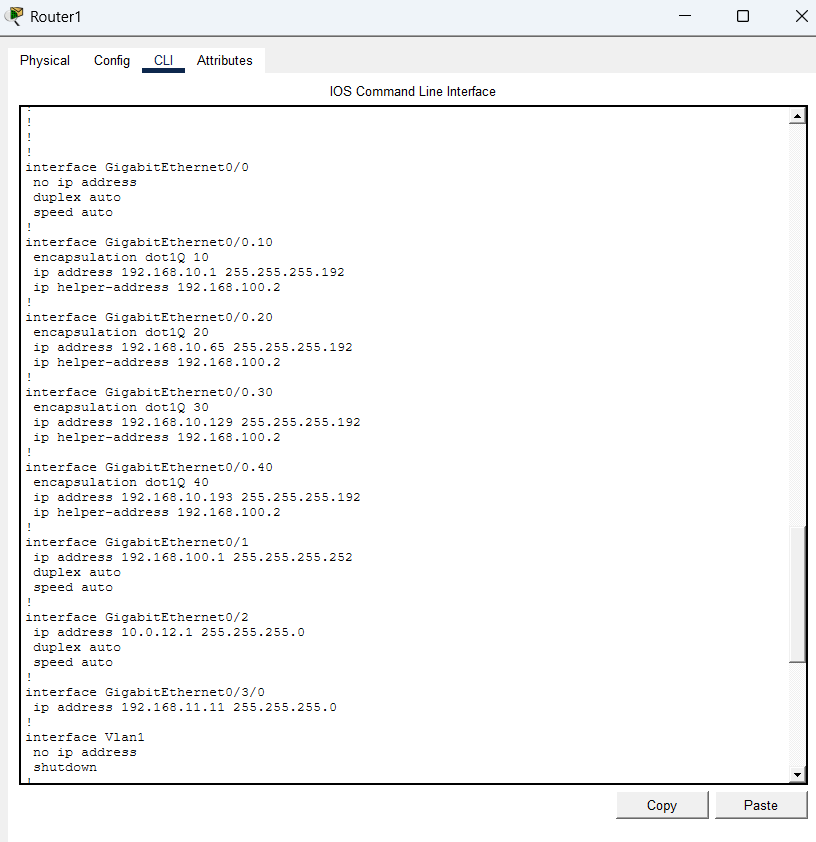

**2. Centralized DHCP Server**

A centralized DHCP server dynamically assigns IP addresses to:

VLAN10

VLAN20

VLAN30

VLAN40

Remote LAN

DHCP relay is configured on router interfaces using:

ip helper-address 192.168.100.2

The centralized DHCP server is connected through the:

192.168.100.0/30 network.

**3. OSPF Dynamic Routing**

All routers participate in:

router ospf 1 using:

Area 0

OSPF dynamically exchanges routing information between all routers.

 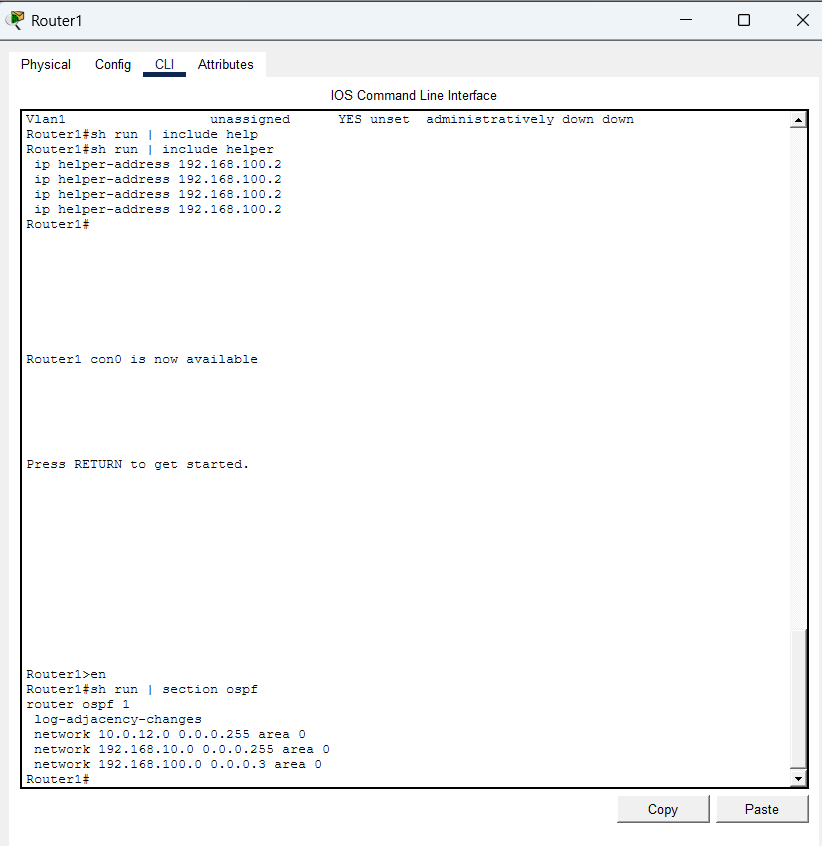

 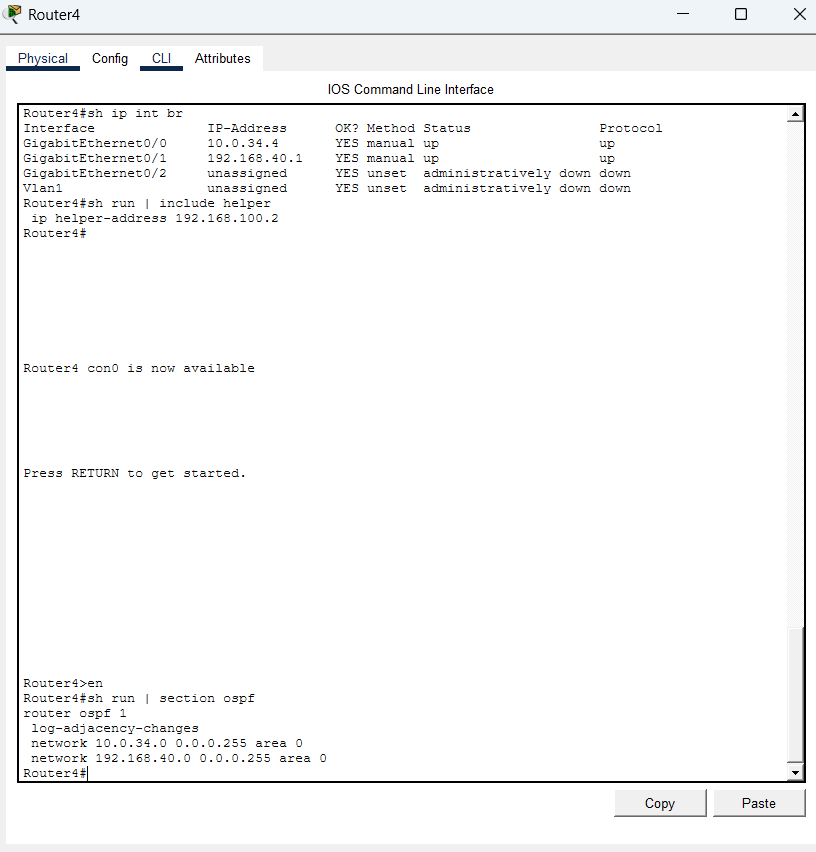

 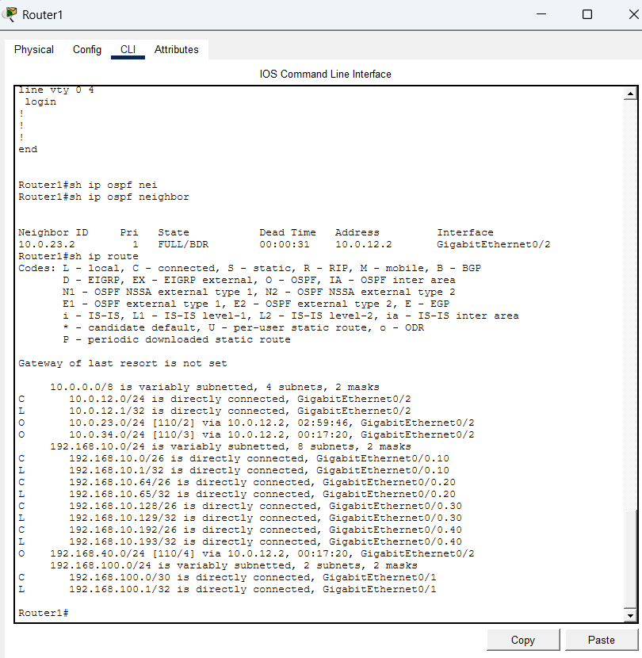

 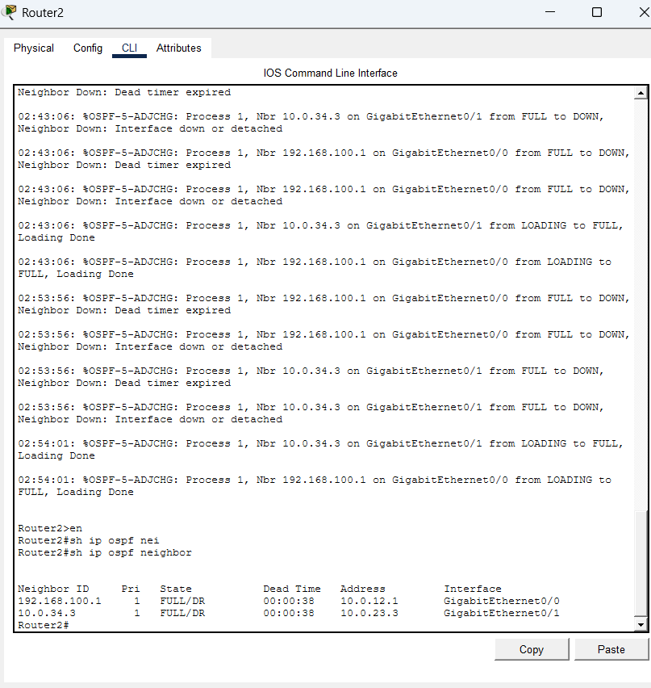

 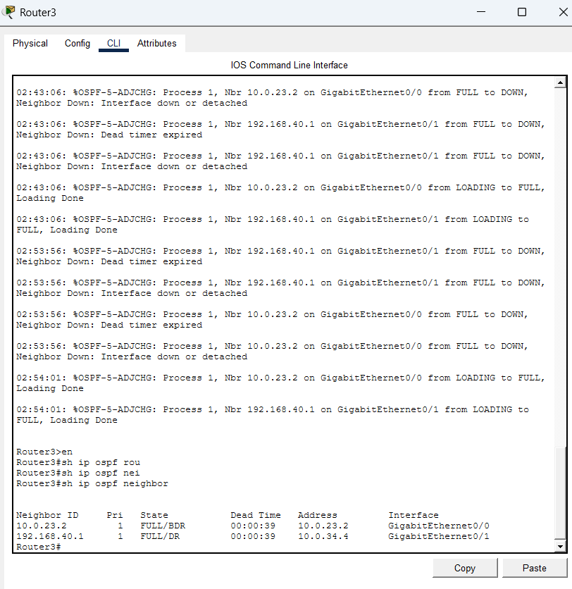

 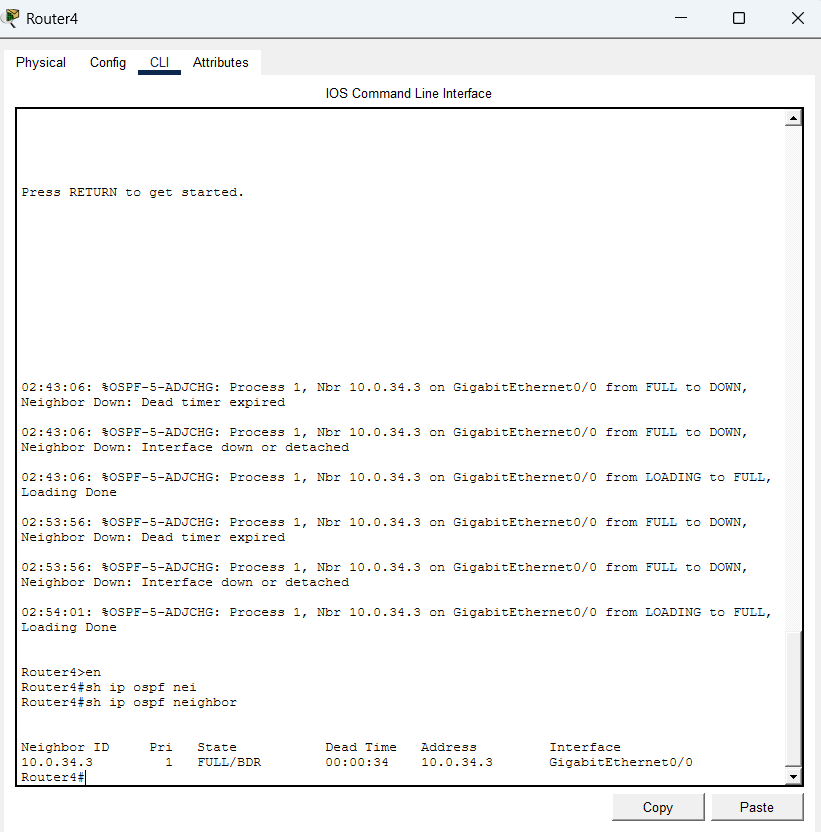

 

**4. Wireless Connectivity**

VLAN 40 includes wireless access through an Access Point connected to:

Laptop - 192.168.10.200

Smartphone - 192.168.10.195

Tablet - 192.168.10.198

 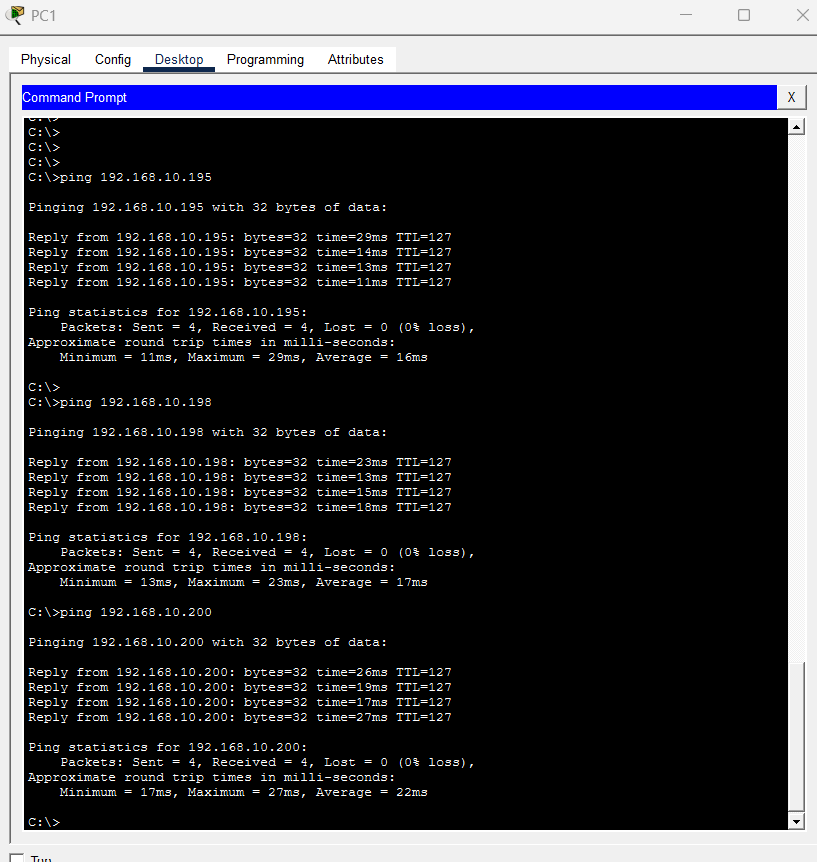

**IP Addressing Scheme**

**WAN Networks**

Connection	Network:

Router1 ↔ Router2	10.0.12.0/24

Router2 ↔ Router3	10.0.23.0/24

Router3 ↔ Router4	10.0.34.0/24

**Router Interface Configuration**

**Router1**

Interface	IP Address

G0/0.10	192.168.10.1/26

G0/0.20	192.168.10.65/26

G0/0.30	192.168.10.129/26

G0/0.40	192.168.10.193/26

G0/1	192.168.100.1/30

G0/2	10.0.12.1/24

 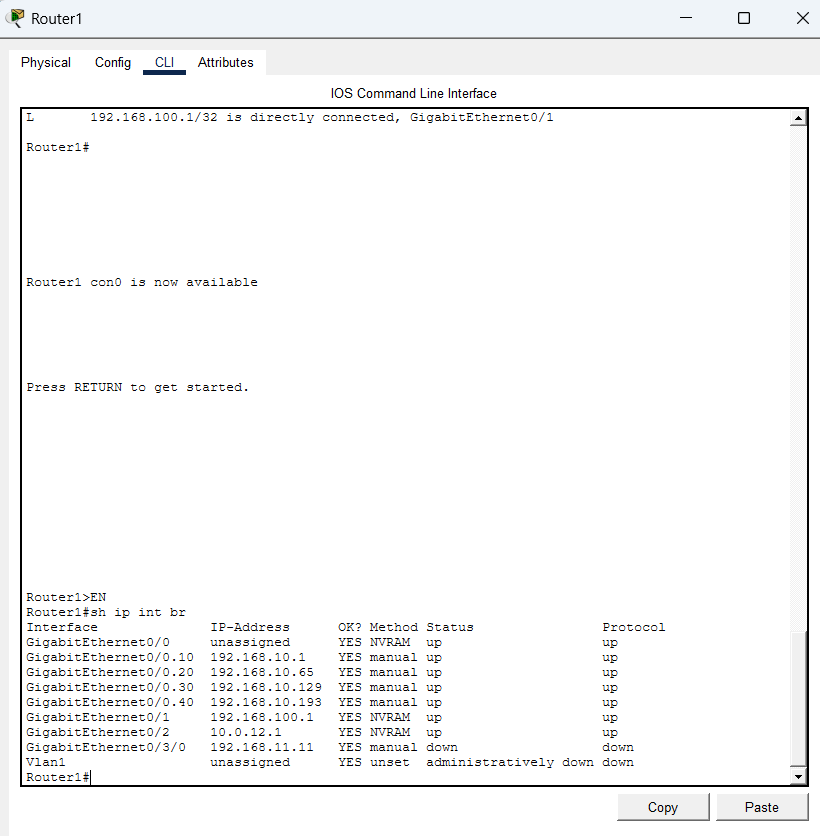

**Router2**

Interface	IP Address

G0/0	10.0.12.2/24

G0/1	10.0.23.2/24

**Router3**

Interface	IP Address

G0/0	10.0.23.3/24

G0/1	10.0.34.3/24

**Router4**

Interface	IP Address

G0/0	10.0.34.4/24

G0/1	192.168.40.1/24

**DHCP Server Configuration**

The DHCP server contains separate pools for each VLAN and the remote branch office LAN.

DHCP Pools:

**Pool Name -	Network -	Default Gateway -	Start IP -	Subnet Mask**

VLAN10 -	192.168.10.0/26 -	192.168.10.1 -	192.168.10.10	- 255.255.255.192

VLAN20 -	192.168.10.64/26 -	192.168.10.65 -	192.168.10.70 -	255.255.255.192

VLAN30 -	192.168.10.128/26 -	192.168.10.129 -	192.168.10.130 -	255.255.255.192

VLAN40 -	192.168.10.192/26 -	192.168.10.193 -	192.168.10.194 -	255.255.255.192

POOL_ROUTER_4 -	192.168.40.0/24 -	192.168.40.1 -	192.168.40.10 -	255.255.255.0

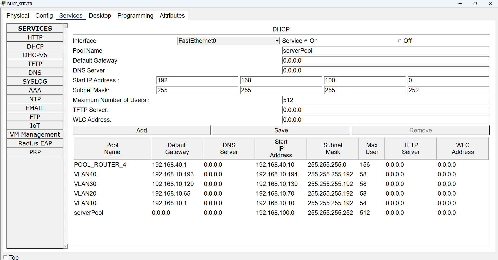

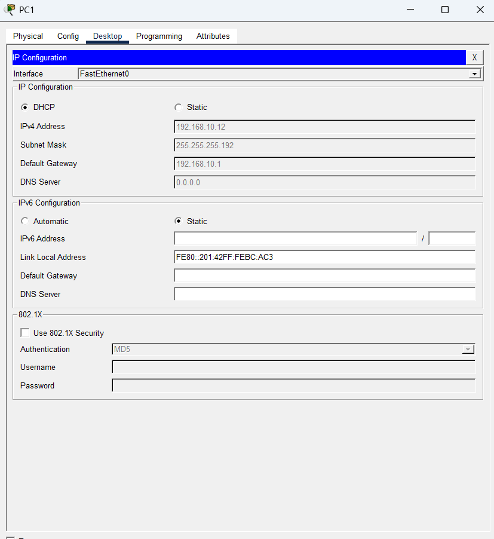

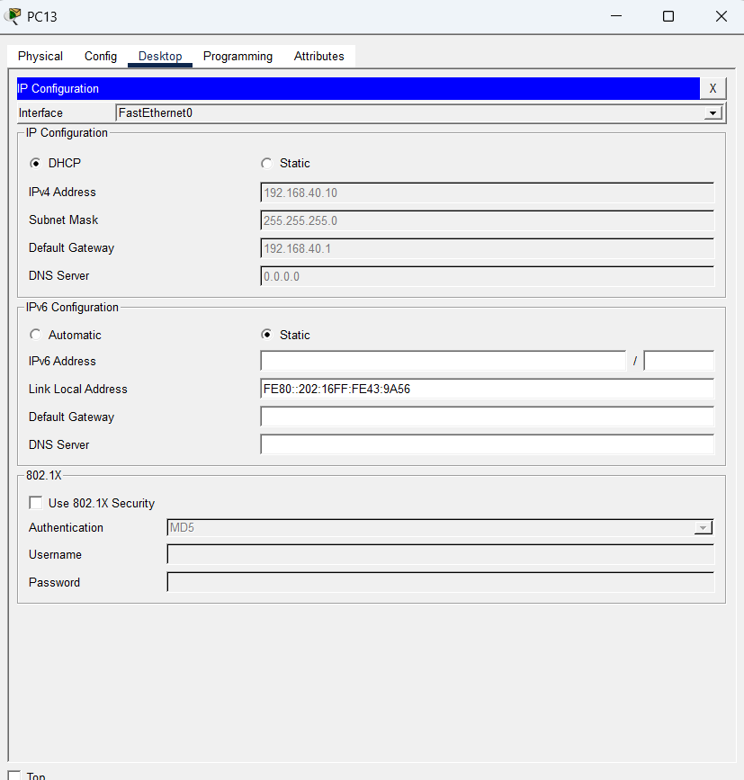

**Connectivity Verification**

**Verify OSPF Neighbors**

show ip ospf neighbor

**Verify Routing Table**

show ip route

**Verify Interfaces**

show ip interface brief

**Test Connectivity**

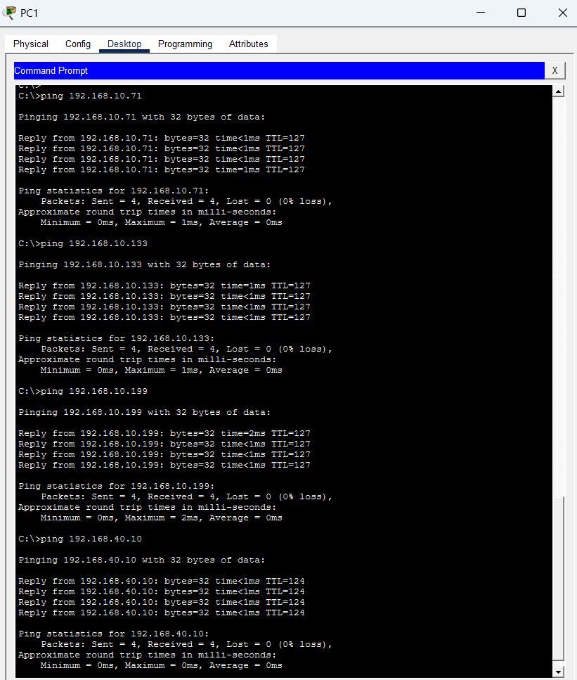

**Project Features**

VLAN Segmentation

Router-on-a-Stick Configuration

Centralized DHCP Server

DHCP Relay Implementation

OSPF Dynamic Routing

Wireless Network Integration

Enterprise WAN Connectivity

Future Improvements

Possible future enhancements:

Access Control Lists (ACLs)

SSH Remote Access

NAT/PAT

EtherChannel

HSRP/VRRP Redundancy

DHCP Snooping

Port Security

**Author**

Ravi Kumar

**License**

This project is intended for:

Educational purposes

Networking practice

